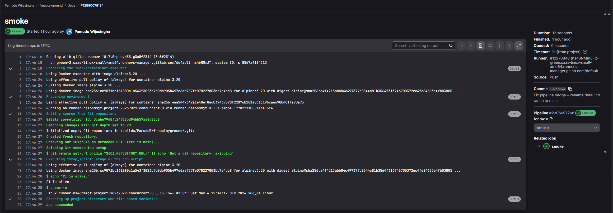

# Week 01 - Kickoff and setup

## Goal
Set up FreePlayground as a long-term engineering growth repo with working CI, clean structure, and a repeatable weekly shipping format.

## Must ship (definition of done)
- [x] Create repo and folder skeleton (local WSL + remote)
- [x] Add weekly notes structure (docs/weekly/) and Week 01 log
- [x] Add GitLab CI scaffold and confirm pipeline runs on push
- [x] Add GitLab pipeline badge to README
- [x] Rename default branch from master to main (and push updates)
- [x] Add CHANGELOG.md
- [x] Add docs/game-plan.md
- [x] Set up GitLab to GitHub mirroring (push mirror)

## Stretch (nice to have)
- [x] Cost guardrails checked (AWS + Azure)
- [ ] Add repo description and topics, then pin the repo on GitHub and GitLab

## What I did (short log)
- Initialized the repo inside WSL and set Git identity.
- Added both remotes (GitLab + GitHub) and pushed initial commits.
- Created a minimal GitLab CI pipeline and verified a green run.
- Added pipeline status badge to the README.
- Renamed default branch to main.
- Set up GitLab push-mirroring to GitHub and verified sync.
- Set AWS and Azure cost guardrails (budgets and alerts) so experiments cannot silently burn money.

## Cost guardrails (what is set)
### AWS
- Budgets created:
  - My_Monthly_Cost_Budget ($5)
  - My_Zero-Spend_Budget ($0.01 tripwire)
- Cost Anomaly Detection:
  - Alert subscription active
- Billing alerts:
  - Free tier alerts enabled
  - Billing alerts enabled

### Azure
- Budget created:
  - zero_spent ($1 monthly tripwire)
- Subscription:
  - Azure for Students is active
- Credits:
  - Student credits visible (acts as a hard safety buffer)

## What I learned
- Task lists render properly with "- [ ]" and "- [x]" checkbox syntax (GitHub task list format).
- GitLab pipeline badges are URLs tied to project path and default branch.
- Mirroring fails fast if auth is wrong, and logs are usually explicit about it.
- Budgets and alerts do not prevent spend, they reduce the time-to-notice so teardown discipline matters.

## Notes / commands / snippets
```bash
# Git identity (one-time)
git config --global user.email "pamuduwijesingha2k20@gmail.com"
git config --global user.name  "Pamudu Wijesingha"

# Remotes
git remote add gitlab git@gitlab.com:PamuduW/freeplayground.git
git remote add github git@github.com:PamuduW/freeplayground.git
git remote -v

# Push
git push -u gitlab main
git push -u github main
```

## Evidence (links + screenshots)
- Links:
  - GitHub: https://github.com/PamuduW/freeplayground
  - GitLab: https://gitlab.com/PamuduW/freeplayground
  - Pipelines: https://gitlab.com/PamuduW/freeplayground/-/pipelines

- Screenshots:
   
  
  

## Retro
- Went well:
  - Shipping the scaffold fast made the repo feel real immediately.
  - CI + badge makes progress visible and keeps me honest.
  - Cost guardrails were set early, which protects future labs.

- Needs improvement:
  - Add repo metadata (description + topics) and pin it, so it presents well as a portfolio project.

- Next week adjustment (scope can change, outcome stays):
  - Start Week 02 labs with the guardrails already in place.
