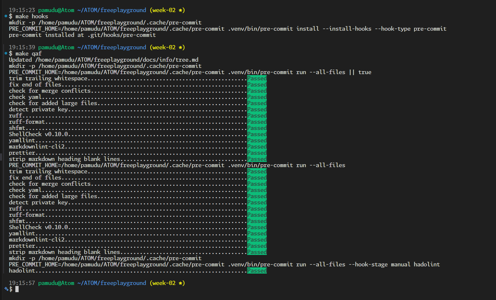

# Week 02 Add-on 01 - Linting and formatting baseline
## Goal
Ship a portfolio-grade linting and formatting workflow with one local command, while keeping CI focused on CI/CD flow.

## Must ship (definition of done)
- [x] Add pre-commit as my single local quality runner.
- [x] Add `make hooks` and `make qa` workflow.
- [x] Keep linting and formatting local via pre-commit and make targets.
- [x] Add local quality config files for Ruff, YAML, Markdown, and Prettier.
- [x] Add a quality workflow guide in `docs/info/`.

## Stretch (nice to have)
- [x] Add manual-stage hadolint hook.
- [x] Add a local Markdown heading normalizer script.

## What I did (short log)
- I added `Makefile` targets for hook install and two-pass quality checks.
- I configured `.pre-commit-config.yaml` for hygiene, Python, shell, YAML, Markdown, and Docker checks.
- I added tool configs in repo root and documented the workflow in README and info docs.
- I added `10-automation-scripts/quality/strip_md_heading_blank_lines.py` and wired it into pre-commit.
- I verified `make qa`, `make hadolint`, and `make qa-full` runs.

## What I learned
- A two-pass `make qa` pattern gives me reliable auto-fix + clean verification.
- Running `make qa` before staging avoids pre-commit stash conflicts.
- Keeping configs in-repo keeps WSL and CI behavior aligned.

## Notes / commands / snippets
Commands I ran that matter:

```bash
make hooks
make qa
.venv/bin/pre-commit run --all-files --hook-stage manual hadolint
```

## Evidence (links + screenshots)
### Links
- GitHub: https://github.com/PamuduW/freeplayground
- GitLab: https://gitlab.com/PamuduW/freeplayground
- Branch: week-02 (legacy naming for this week; standard is `week/NN-short-theme`)
- MR: https://gitlab.com/PamuduW/freeplayground/-/merge_requests/1
- Pipeline: https://gitlab.com/PamuduW/freeplayground/-/pipelines
- Tag (optional): week-02-addon-01
- Quality guide: [docs/info/linting-formatting-workflow.md](../info/linting-formatting-workflow.md)

### Screenshots
  

## Retro
### Went well
- One-command quality checks reduced pre-push friction.
- Keeping linting local removed CI runner dependency issues for formatting hooks.

### Needs improvement
- I should capture evidence links and screenshots at the time I run checks.

### Next week adjustment (scope can change, outcome stays)
- Keep `make qa` as a required pre-push step and update weekly evidence continuously.
