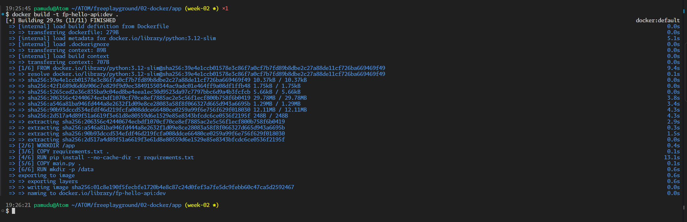
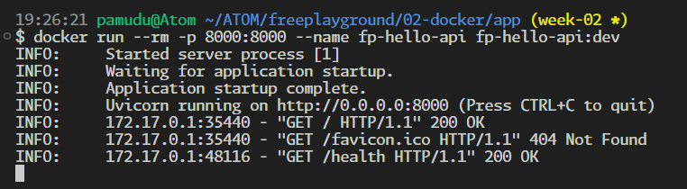

# Week 02 - Docker fundamentals
## Goal
Ship my Docker fundamentals notes plus one small Dockerized app I can build and run locally.

## Must ship (definition of done)
- [x] 02-docker/README.md with build/run/logs/volumes/networks
- [x] One Dockerized simple app (02-docker/app/)
- [x] Evidence captured (commands + screenshots + links)

## Stretch (nice to have)
- [x] Multi-stage Docker build

## What I did (short log)
- I documented the Week 02 Docker workflow in `02-docker/README.md` and module docs under `02-docker/info/`.
- I built a small FastAPI app in `02-docker/app/` with a Dockerfile and a multistage Dockerfile.
- I captured repeatable commands for build, run, logs, volumes, and network verification.

## What I learned
- Keeping command notes close to module code makes weekly evidence easier to maintain.
- A simple request log written to `/data` is enough to demonstrate real volume persistence.
- A multistage image flow is easier to reason about when builder and runtime concerns are separated.

## Notes / commands / snippets
```bash
# build
docker build -t fp-hello-api:dev ./02-docker/app

# run
docker run --rm -p 8000:8000 --name fp-hello-api fp-hello-api:dev

# logs
docker logs -f fp-hello-api

# volumes
docker volume create fp_hello_data
docker run --rm -p 8000:8000 --name fp-hello-api \
  --mount type=volume,src=fp_hello_data,dst=/data \
  fp-hello-api:dev

# networks (basic demo)
docker network create fp-net
docker run -d --name fp-hello-api --network fp-net -p 8000:8000 fp-hello-api:dev
docker run --rm --network fp-net busybox:1.36 wget -qO- http://fp-hello-api:8000/
docker rm -f fp-hello-api
docker network rm fp-net
```

## Evidence (links + screenshots)
### Links
- GitHub: https://github.com/PamuduW/freeplayground
- GitLab: https://gitlab.com/PamuduW/freeplayground
- Branch: week-02 (legacy naming for this week; standard is `week/NN-short-theme`)
- MR: https://gitlab.com/PamuduW/freeplayground/-/merge_requests/1
- Pipeline: https://gitlab.com/PamuduW/freeplayground/-/pipelines
- Tag (optional): week-02

### Screenshots
  
  

## Retro
### Went well
- I shipped the core Docker app files and supporting module documentation in the same week.
- I kept commands reproducible so I can rerun the full flow quickly.

### Needs improvement
- None for now.

### Next week adjustment (scope can change, outcome stays)
- I will capture screenshots during command execution and update links in the same commit window.
