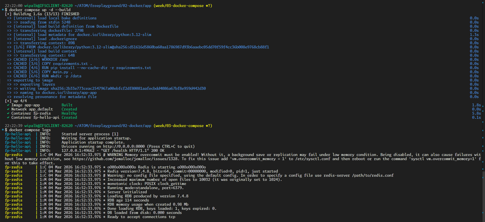
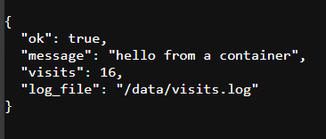

# Week 03 - Docker Compose
## Goal
Build a Compose demo (app + cache), document debugging common failures, and add healthchecks + restart policies.

## Must ship (definition of done)
- [x] Compose demo: app + Redis cache (`02-docker/app/docker-compose.yml`)
- [x] README: how to debug common failures (`02-docker/info/docker-compose.md` — debugging section)

## Stretch (nice to have)
- [x] Add healthchecks + restart policies (both services have healthchecks, `unless-stopped` restart policy)

## What I did (short log)
- Added Redis integration to the FastAPI app — visit counter stored in Redis via `INCR`, `/health` endpoint reports Redis connectivity.
- Created `docker-compose.yml` with two services (app + Redis), named volumes, healthchecks on both, `depends_on: service_healthy`, and `unless-stopped` restart policy.
- Wrote detailed Compose reference doc (`02-docker/info/docker-compose.md`) covering commands, healthchecks, restart policies, networking, volumes, and 6 common debugging scenarios.
- Updated `02-docker/README.md` with Compose quick start and linked new docs.
- Ran the full stack, verified both services healthy, endpoints returning 200, visit counter incrementing, and clean teardown.

## What I learned
- `depends_on` with `condition: service_healthy` is the proper way to handle startup ordering — without it, the app may crash because the dependency isn't ready yet.
- Compose creates a default bridge network with DNS — services reach each other by service name, no manual network setup needed.
- Named volumes survive `docker compose down` but are removed with `docker compose down -v`.
- Redis `INCR` is atomic — safe for concurrent request counting without locks.
- The `vm.overcommit_memory` Redis warning is a WSL2 limitation, not an error.

## Notes / commands / snippets
Commands I ran that matter:

```bash
docker compose up --build            # build + start in foreground (first run)
docker compose up -d --build         # rebuild + start detached
docker compose ps                    # check status + health
docker compose logs                  # combined logs
docker compose down                  # stop + remove containers/network
docker compose down -v               # also remove volumes
docker volume ls                     # verify named volumes persist
docker compose exec redis redis-cli ping   # quick Redis connectivity check
```

## Evidence (links + screenshots)
### Links
- GitHub: https://github.com/PamuduW/freeplayground
- GitLab: https://gitlab.com/PamuduW/freeplayground
- Branch: `week/03-docker-compose`
- MR: https://gitlab.com/PamuduW/freeplayground/-/merge_requests/2
- Pipeline: https://gitlab.com/PamuduW/freeplayground/-/pipelines/2364136056
- Tag (optional): week-03

### Screenshots



## Retro
### Went well
- Compose setup worked on first try — no debugging needed for connectivity or startup ordering.
- All three deliverables (must-ship + stretch) done in one session.
- Reusing the existing FastAPI app kept the scope tight — adding Redis on top was a clean extension.

### Needs improvement
- The app image is 168 MB — could use the multistage Dockerfile with Compose to slim it down.
- No `.env` file for configuration — Redis host/port are hardcoded in the Compose file. Should extract to `.env` for flexibility.

### Next week adjustment (scope can change, outcome stays)
- Week 04 shifts to Linux + scripting fundamentals (`01-foundations/`).
